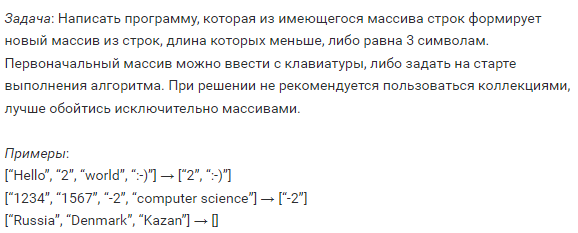
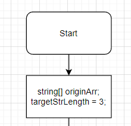
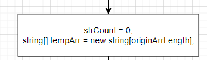

# FINAL_WORK
Final work on the main block of the course "Developer"

---
## Формулировка задачи  

Написать программу, которая из имеющегося массива строк формирует новый массив из строк, длина которых меньше, либо равна 3 символам. Первоначальный массив можно ввести с клавиатуры, либо задать на старте выполнения алгоритма. При решении не рекомендуется пользоваться коллекциями, лучше обойтись исключительно массивами.

---
## Алгоритм решения задачи 

1. Метод принимает на вход первоначальный массив строк и значение длины для отбора строк из массива (в нашем случае три);
    

2. Непосредственно в теле метода создаём:
   * переменную-счётчик подходящих под условие строк;
   * промежуточный массив строк (размером как принимаемый для разбора массив), куда будут сохраняться подходящие значения.
  
    
