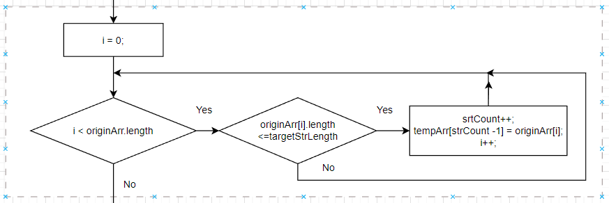
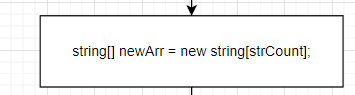
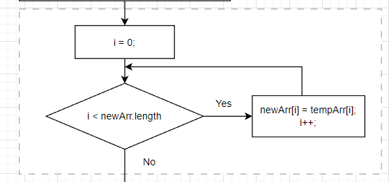

# FINAL_WORK
Final work on the main block of the course "Developer"

---
## Формулировка задачи  

Написать программу, которая из имеющегося массива строк формирует новый массив из строк, длина которых меньше, либо равна 3 символам. Первоначальный массив можно ввести с клавиатуры, либо задать на старте выполнения алгоритма. При решении не рекомендуется пользоваться коллекциями, лучше обойтись исключительно массивами.

---
## Алгоритм решения задачи 

1. Метод принимает на вход первоначальный массив строк и значение длины для отбора строк из массива (в нашем случае три);
    

2. Непосредственно в теле метода создаём:
   * переменную-счётчик подходящих под условие строк;
   * промежуточный массив строк (размером как принимаемый для разбора массив), куда будут сохраняться подходящие значения.
  
    

3. В цикле проходим по каждому элементу (строке) принимаемого изначального массива и проверяем его на соответствие условию (меньше либо равно 3 символам). Если строка удовлетворяет условию:
   * инкрементируем счётчик подходящих строк; 
   * записываем её на первую свободную с начала позицию промежуточного массива. 

    

4. После того как мы проверили на соответствие условиям все элементы изначального массива, мы получили значение количества подходящих строк и промежуточный массив заполненный ими.   Так как длина промежуточного массива равна изначальному (изначальное требование по использованию статичного массива), и заполняется промежуточный массив подходящими строками со своего начала, возможно присутствие неподходящих значений в его "хвосте". Поэтому необходимо отфильтровать необходимые строки в новый конечный массив.
 
Для этого:
    * создаём конечный массив размером в значение нашего счётчика "правильных строк";
    
    
    
    * в цикле последовательно заполняем конечный массив, проходя в цикле по первым n-значения промежуточного массива (где n - значение нашего счётчика строк, или = размер конечного массива); 
      
    
